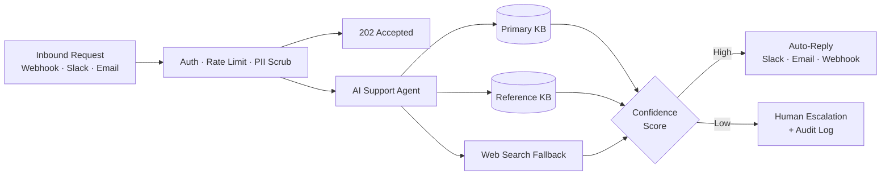

# Neville Ko — AI Product Manager & Builder

> AI Product Manager, Builder & UX Designer — 20 years shipping 0-to-1 products

I'm Neville Ko, Head of Product & Experience at [Distinct AI](https://www.distinctplugins.io/) and an [official n8n creator](https://n8n.io/workflows/18427-seed-a-supabase-ai-knowledge-base-from-notion-with-ollama-embeddings/) with published templates on the n8n marketplace. I have 20 years of experience shipping 0-to-1 products and I'm now building production-grade AI automation for regulated industries like financial services and healthcare.

I specialize in agentic RAG systems, multi-agent orchestration, and governance-aware AI mapped to real compliance frameworks: SEC/FINRA, OSFI E-23, SOC 2 Type II, PCI-DSS v4.0, and OWASP LLM Top 10. My work is production-ready, privacy-first, and built with audit trails, least-privilege tooling, and human-in-the-loop controls.

> Official n8n creator with templates published on the [n8n marketplace](https://n8n.io/creators/). Production workflows on GitHub covering agentic RAG, vector databases, AI agents, and developer utilities.

## Currently

Building a governance-aware AI workflow series for regulated industries including financial services, healthcare, and legal. Each workflow maps to a real compliance framework: SEC/FINRA and OSFI E-23 for model alignment, ISO 27001 for access control, SOC 2 and PCI-DSS v4.0 for data security.

---

## Featured Work

### [n8n Workflow Templates](https://github.com/nenedesign/n8n-workflows)
Production-ready automation workflows: agentic RAG, AI agents, and developer utilities; all importable directly into n8n.

| Workflow | Category | Level | Use Case | Canvas |
|----------|----------|-------|----------|--------|
| [Autonomous customer support agent](https://github.com/nenedesign/n8n-workflows/tree/main/ai-agents/autonomous-customer-support-agent) | AI Agents | Advanced | SaaS & enterprise customer support | [View](https://github.com/nenedesign/n8n-workflows/blob/main/ai-agents/autonomous-customer-support-agent/preview.png) |
| [Multi-KB agentic RAG assistant](https://github.com/nenedesign/n8n-workflows/tree/main/rag/multi-kb-agentic-rag-assistant) | RAG | Advanced | Internal knowledge Q&A for teams | [View](https://github.com/nenedesign/n8n-workflows/blob/main/rag/multi-kb-agentic-rag-assistant/preview.png) |
| [Slack Gemini Agent](https://github.com/nenedesign/n8n-workflows/tree/main/ai-agents/slack-gemini-agent) | AI Agents | Intermediate | AI assistant for Slack workspaces | [View](https://github.com/nenedesign/n8n-workflows/blob/main/ai-agents/slack-gemini-agent/preview.png) |
| [Gmail AI Triage](https://github.com/nenedesign/n8n-workflows/tree/main/ai-agents/gmail-ai-triage) | AI Agents | Intermediate | High-volume inbox management | [View](https://github.com/nenedesign/n8n-workflows/blob/main/ai-agents/gmail-ai-triage/preview.png) |
| [Seed a Supabase AI knowledge base from Notion](https://github.com/nenedesign/n8n-workflows/tree/main/rag/seed-supabase-from-notion) | RAG | Intermediate | RAG pipeline ingestion from Notion | [View](https://github.com/nenedesign/n8n-workflows/blob/main/rag/seed-supabase-from-notion/preview.png) |
| [AI Daily Briefing Bot](https://github.com/nenedesign/n8n-workflows/tree/main/utilities/ai-daily-briefing-bot) | Utilities | Beginner | Daily news digest for teams | [View](https://github.com/nenedesign/n8n-workflows/blob/main/utilities/ai-daily-briefing-bot/preview.png) |
| [Claude to Slack MCP Connection Test](https://github.com/nenedesign/n8n-workflows/tree/main/utilities/claude-to-slack-mcp-test) | Utilities | Beginner | Developer MCP integration testing | [View](https://github.com/nenedesign/n8n-workflows/blob/main/utilities/claude-to-slack-mcp-test/preview.png) |
| [URL & Article Summarizer to Slack](https://github.com/nenedesign/n8n-workflows/tree/main/utilities/url-article-summarizer-to-slack) | Utilities | Beginner | Content research & curation | [View](https://github.com/nenedesign/n8n-workflows/blob/main/utilities/url-article-summarizer-to-slack/preview.png) |
| [API Health Monitor](https://github.com/nenedesign/n8n-workflows/tree/main/utilities/api-health-monitor) | Utilities | Beginner | DevOps uptime monitoring | [View](https://github.com/nenedesign/n8n-workflows/blob/main/utilities/api-health-monitor/preview.png) |
| [RSS Feed to Slack Alert](https://github.com/nenedesign/n8n-workflows/tree/main/utilities/rss-feed-to-slack-alert) | Utilities | Beginner | Topic & brand monitoring | [View](https://github.com/nenedesign/n8n-workflows/blob/main/utilities/rss-feed-to-slack-alert/preview.png) |
| [GitHub PR to Slack Notifier](https://github.com/nenedesign/n8n-workflows/tree/main/utilities/github-pr-to-slack-notifier) | Utilities | Beginner | Engineering team PR visibility | [View](https://github.com/nenedesign/n8n-workflows/blob/main/utilities/github-pr-to-slack-notifier/preview.png) |
| [AI Webhook Classifier](https://github.com/nenedesign/n8n-workflows/tree/main/utilities/ai-webhook-classifier) | Utilities | Intermediate | Support triage & content routing | [View](https://github.com/nenedesign/n8n-workflows/blob/main/utilities/ai-webhook-classifier/preview.png) |

---

## Research Focus

- **Multi-Agent Orchestration** — modality-agnostic, agent-to-agent workflows focused on security and privacy
- **Privacy-First Local AI** — on-device open-weight models for sensitive financial and healthcare data
- **Context & Memory Management** — hybrid memory retrieval for context-aware personalization
- **Hybrid Inference Routing** — optimizing token efficiency, latency, and cost across cloud and local

---

## System Architecture

Production customer support agent with 50 nodes, async webhook intake, multi-KB RAG with web search fallback, confidence-gated routing, and full audit trail.

---

## Stack

**Automation & Agents:** `n8n` · `Claude Code` · `MCP Servers` · `LangChain` · `Google ADK`  
**Inference & Models:** `Ollama` · `Docker` · `OpenRouter` · `Claude API` · `Gemini API` · `Perplexity API`  
**Data & Storage:** `Supabase` · `Postgres` · `Notion` · `Obsidian` · `Open WebUI`

---

**Links:** [Portfolio](https://www.fromus.ca/ai-builds) · [LinkedIn](https://www.linkedin.com/in/nevilleko/) · [n8n Official Creator](https://n8n.io/workflows/18427-seed-a-supabase-ai-knowledge-base-from-notion-with-ollama-embeddings/) · [n8n Marketplace](https://n8n.io/creators/)

---

Open to advisory, consulting, and collaboration on AI automation, agentic systems, and governance-aware AI for regulated industries. [Connect on LinkedIn](https://www.linkedin.com/in/nevilleko/)
