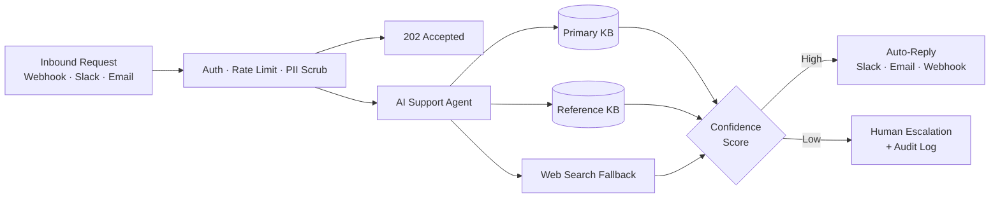

# Neville Ko — AI Product Manager & Builder

Head of Product & Experience at [Distinct AI](https://www.distinctplugins.io/) · [Official n8n Creator](https://n8n.io/workflows/18427-seed-a-supabase-ai-knowledge-base-from-notion-with-ollama-embeddings/) · 20 years shipping 0-to-1 products

I architect and ship production-grade AI automation systems — agentic RAG pipelines, multi-agent orchestration, and privacy-first local inference. Currently focused on governance-aware AI for regulated industries (financial services, healthcare).

---

## Featured Work

### [n8n Workflow Templates](https://github.com/nenedesign/n8n-workflows)
Production-ready automation workflows: agentic RAG, AI agents, and developer utilities — importable directly into n8n.

| Workflow | Category | Level | Canvas |
|----------|----------|-------|--------|
| [Autonomous customer support agent](https://github.com/nenedesign/n8n-workflows/tree/main/ai-agents/autonomous-customer-support-agent) | AI Agents | Advanced | [View](https://github.com/nenedesign/n8n-workflows/blob/main/ai-agents/autonomous-customer-support-agent/preview.png) |
| [Multi-KB agentic RAG assistant](https://github.com/nenedesign/n8n-workflows/tree/main/rag/multi-kb-agentic-rag-assistant) | RAG | Advanced | [View](https://github.com/nenedesign/n8n-workflows/blob/main/rag/multi-kb-agentic-rag-assistant/preview.png) |
| [Slack Gemini Agent](https://github.com/nenedesign/n8n-workflows/tree/main/ai-agents/slack-gemini-agent) | AI Agents | Intermediate | [View](https://github.com/nenedesign/n8n-workflows/blob/main/ai-agents/slack-gemini-agent/preview.png) |
| [Seed Supabase from Notion](https://github.com/nenedesign/n8n-workflows/tree/main/rag/seed-supabase-from-notion) | RAG | Intermediate | [View](https://github.com/nenedesign/n8n-workflows/blob/main/rag/seed-supabase-from-notion/preview.png) |
| [Claude to Slack MCP Test](https://github.com/nenedesign/n8n-workflows/tree/main/utilities/claude-to-slack-mcp-test) | Utilities | Beginner | [View](https://github.com/nenedesign/n8n-workflows/blob/main/utilities/claude-to-slack-mcp-test/preview.png) |

---

## System Architecture

Production customer support agent — 50 nodes, async webhook intake, multi-KB RAG with web search fallback, confidence-gated routing, and full audit trail.

---

## Research Focus

- **Multi-Agent Orchestration** — modality-agnostic, agent-to-agent workflows focused on security and privacy
- **Privacy-First Local AI** — on-device open-weight models for sensitive financial and healthcare data
- **Context & Memory Management** — hybrid memory retrieval for context-aware personalization
- **Hybrid Inference Routing** — optimizing token efficiency, latency, and cost across cloud and local

---

## Stack

**Automation & Agents:** `n8n` · `Claude Code` · `MCP Servers` · `LangChain` · `Google ADK`  
**Inference & Models:** `Ollama` · `Docker` · `OpenRouter` · `Claude API` · `Gemini API` · `Perplexity API`  
**Data & Storage:** `Supabase` · `Postgres` · `Notion` · `Obsidian` · `Open WebUI`

---

**Links:** [Portfolio](https://www.fromus.ca/ai-builds) · [LinkedIn](https://www.linkedin.com/in/nevilleko/) · [n8n Official Creator](https://n8n.io/workflows/18427-seed-a-supabase-ai-knowledge-base-from-notion-with-ollama-embeddings/) · [n8n Marketplace](https://n8n.io/creators/)

---

Open to advisory, consulting, and collaboration on AI automation, agentic systems, and governance-aware AI for regulated industries — [nenedesign@gmail.com](mailto:nenedesign@gmail.com)
